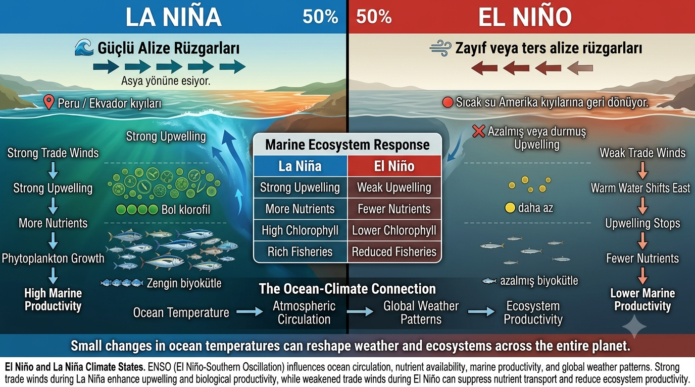

# Oceanography and Climate Systems 🌊

An independent research project exploring ocean circulation, climate regulation, atmospheric teleconnections, and the role of ocean systems in shaping global weather and marine ecosystems.

## Research Question

How do ocean currents and climate systems influence global temperatures, marine ecosystems, and weather patterns around the world?

## Research Areas

- Oceanography

- Climate Science

- Marine Ecology

- Climate Systems

- Data Analysis

- Scientific Research

## Project Highlights

### Thermohaline Circulation

Understanding how temperature and salinity differences drive the global ocean conveyor belt.

### Gulf Stream and AMOC

Examining the role of Atlantic circulation systems in regulating climate.

### ENSO Dynamics

Exploring El Niño and La Niña and their impact on weather and ecosystems.

### Climate Monitoring

Investigating how satellite systems, Argo floats, and ocean observations support climate research.

## Skills Demonstrated

- Oceanography
- Climate Science
- Marine Ecology
- Data Analysis
- Scientific Research
- Critical Thinking
- Systems Thinking
- Scientific Communication
  
## Project Visuals

### Gulf Stream and AMOC

Examining how weakening ocean circulation may influence climate systems and marine ecosystems.

---

### ENSO Dynamics

Understanding the differences between El Niño and La Niña climate phases.

---

### Marine Ecosystem Responses

Exploring how ENSO events affect marine productivity and ecosystem stability.

## Project Files

- Research Report (PDF)
- Figures and Infographics
- References

## Author

Sarp AKAR
Prospective Molecular Biology Student

