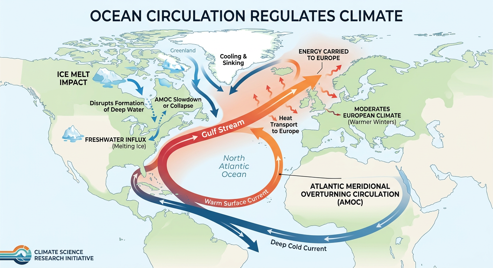
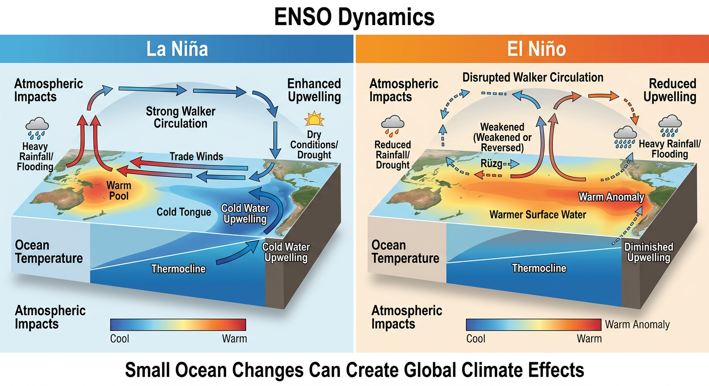
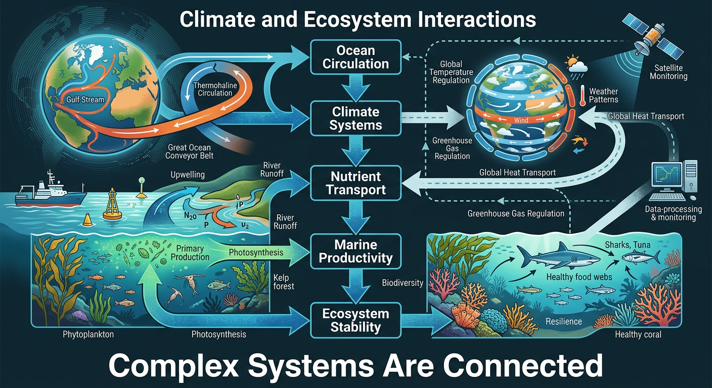

## Project Status

🚧 In Development

# Oceanography and Climate Systems 

An independent research project exploring ocean circulation, climate systems, scientific modeling, and the role of large-scale environmental processes in shaping Earth's climate.

## Research Question

How do ocean currents and climate systems influence global temperatures, weather patterns, and environmental processes around the world?

## Research Areas

- Oceanography

- Climate Science

- Systems Thinking

- Scientific Modeling

- Data Analysis

- Scientific Research

## Project Highlights

### Thermohaline Circulation

Understanding how temperature and salinity differences drive the global ocean conveyor belt and influence climate regulation.

### Gulf Stream and AMOC

Examining the role of Atlantic circulation systems in transporting heat, regulating climate, and influencing environmental stability.

### ENSO Dynamics

Exploring El Niño and La Niña as examples of large-scale climate processes and system interactions.

### Climate Monitoring

Investigating how satellites, Argo floats, environmental observations, and data analysis support scientific modeling and climate research.

## Skills Demonstrated

- Systems Thinking
- Scientific Modeling
- Data Analysis
- Scientific Research
- Critical Thinking
- Scientific Communication
- Climate Science
- Oceanography
- Problem Solving
  
## Project Visuals

### Gulf Stream and AMOC

Examining how large-scale ocean circulation systems influence climate regulation and environmental stability.

---

### ENSO Dynamics

Understanding how El Niño and La Niña affect interconnected climate systems around the world.

---

### Climate and Ecosystem Interactions

Exploring how environmental systems respond to changes in ocean circulation and climate patterns.

## Project Files

- Research Report (PDF)
- Figures and Infographics
- References
- 
### Access Full Report
[Oceanography and Climate Systems Report](Oceanography_and_Climate_Systems.pdf)

## Author

Sarp AKAR

